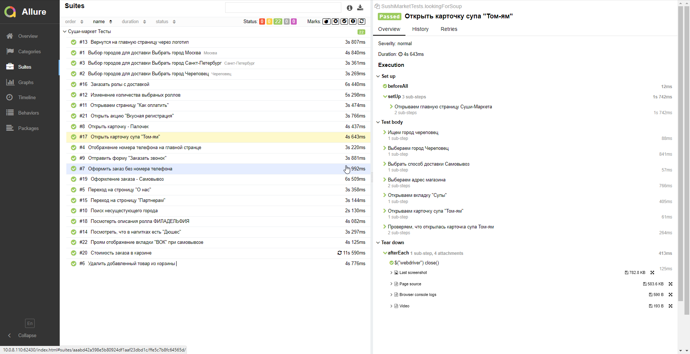

# Проект по автоматизации тестирования сайта Суши-Маркет
<a target="_blank" href="https://cherepovec.sushi-market.com/">Вэб сайт Суши-Маркет</a>

## :pushpin: Содержание:

- [Технологии и инструменты](#technologist-технологии-и-инструменты)
- [Реализованные проверки](#technologistt-Реализованные-проверки)
- [Запуск тестов](#earth_africa-Запуск-тестов)

## :technologist: Технологии и инструменты

<p align="center">
<a href="https://www.jetbrains.com/idea/"></a>
<a href="https://www.java.com/"></a>
<a href="https://github.com/"></a>
<a href="https://junit.org/junit5/"></a>
<a href="https://gradle.org/"></a>
<a href="https://selenide.org/"></a>
<a href="https://github.com/allure-framework/allure2"></a>
</p>

## :technologistt: Реализованные проверки

- ✓ Выбор городов для доставки.
- ✓ Поиск несущестующего города.
- ✓ Переход на строницу "О нас".
- ✓ Отправить форму "Заказать звонок".
- ✓ Оформление заказа - Самовывоз.
- ✓ Удалить добавленный товар из корзины.
- ✓ Переход на строницу "Партнерам".
- ✓ Открыть акцию  "Вкусная регистрация".
- ✓ Вернутся на главную страницу через логотип.
- ✓ Заказать ролы с доставкой
- ✓ Посмотерть описания ролла ФИЛАДЕЛЬФИЯ
- ✓ Открываем страницу "Как оплатить"
- ✓ Посмотреть, что в напитках есть "Дюшес"
- ✓ Отображение номера телефона на главной странце
- ✓ Стоимость заказа в карзине
- ✓ Открыть карточку супа "Том-ям"
- ✓ Проям отображение вкладки "ВОК" при самовывозе
- ✓ Оформить заказ без номера телефона
- ✓ Изменение количества выбраных роллов
- ✓ Открыть карточку - Палочек 

## :computer: Запуск тестов

Локальный запуск:
```bash
gradle clean test
через интерфей INTELLIG IDEA
```
## </a> Отчет в <a target="_blank" href="https://jenkins.autotests.cloud/job/berezkindv_performance_lab_complete_project/22/allure/">Allure report</a>
### Тесты

<p align="center">

</p>
